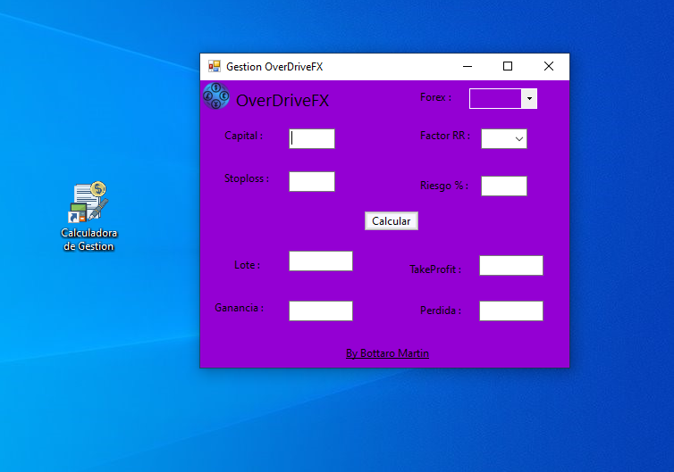

<h1 align="center">OverDriveFX-Gestionderiesgo 👋</h1>

 

Proyecto personal el cual fue destinado a la academia de trading de OverDriveFX, eficaz y comodo a la hora de ejecutar cuentas de complejidad mientras se hace trading. 
La misma calcula TaKeProfit, Ganancia, Perdida  y el Lote a usar dependiendo del par de divisa, stoploss elegido, porcentaje de perdida estimado y factor RR. 

Descarga del archivo ejecutable:  
https://github.com/martu344/OverDriveFX-Gestionderiesgo/raw/main/Calculadora%20de%20Gestion-setup.exe  
se deben dar los permisos necesarios al ser un editor desconocido

